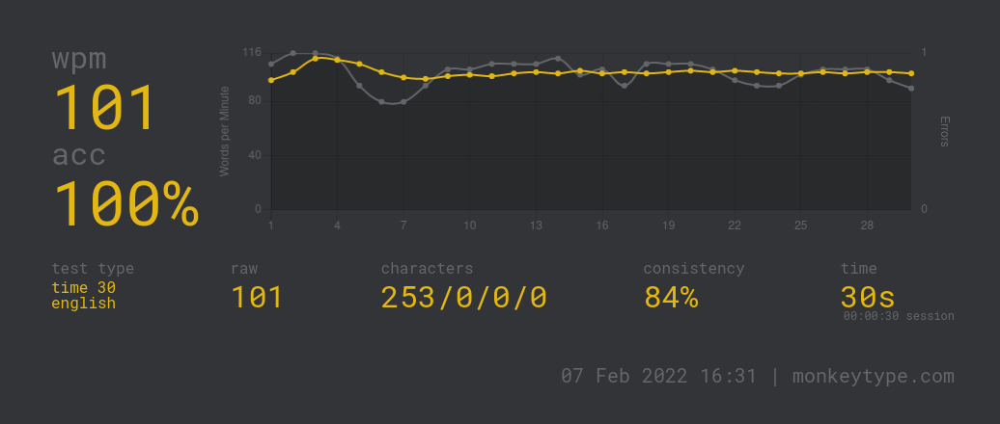

# Where to find everything that will be presented

Github: [github.com/FBorowiec/developer_productivity](https://www.github.com/FBorowiec/developer_productivity)

Prerequisites:

* **A Linux OS**
* **Docker**

---

# Introduction

Course aimed at people who want to become more effective and more productive programmers.

**From "The Pragmatic Programmer"**:


_What makes a Pragmatic Programmer?_

* Early adopter/fast adapter
* Inquisitive
* Critical thinker
* Realistic
* Jack of all trades
* Caring about your craft

Goals of a Pragmatic Programmer

* Learning at least one new language every year
* Read a technical book a month
* Experiment with different environments

---

# Typical user experience

* IDE


---

* Terminal management


---

* Window management


So much overhead!

---

# Developer productivity - all the things that separate you from working

Soft skills | Dev productivity | Hard skills

## Topics

```bash
0. Fast typing
1. Vim
2. Ansible
3. Dotfiles
4. Zshell
5. Tmux
6. Linux core utils
7. DWM
8. Git worktrees
9. AI pair programming
```

Prerequisites:

* A linux OS
* Familiarity with regexes

---

# Fast typing


---

# Fast typing



