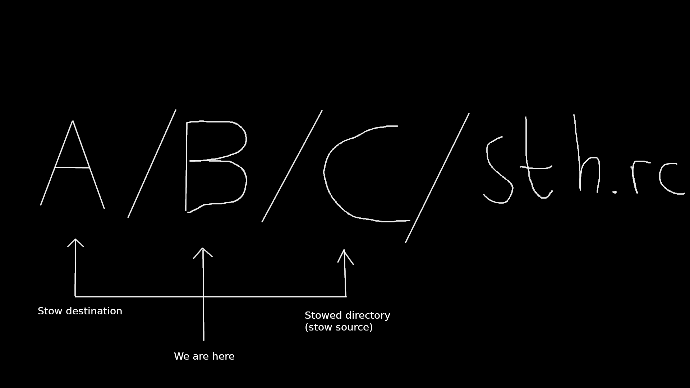

# Use case

1. Programs we use with our configuration
2. Keep track and commit changes over time
3. Compatible with any OS

---
# What are dotfiles?

A configuration file of your program.

Example for `~/.config/nvim/init.vim`:

```viml
set tabstop=4 softtabstop=4
set shiftwidth=4
set expandtab
set smartindent
```

---
# GNU/Stow

It's simple! -> it only manages simlinks (therefore is OS and version-able).



---
# Stow example

* `cd dotfiles/target_dir/stow_dir`
* `stow nvim`
* `find .`

As you can see nothing changes under `target_dir`. But now check the `target_dir`.

* `cd ..`
* `ls -la`

You can also unstow a directory:

* `stow -D nvim`

And stow is smart enough to abort when you have conflicting tree structures :)

---
# Stow with Ansible

An example of `dotfiles.task`:

## `dotfiles.task`

```Ansible
- name: Installing stow
  apt: name=stow
  tags:
    - install
    - dotfiles
    - stow
- name: Cloning .dotfiles
  ansible.builtin.git:
    repo: 'git@github.com:FBorowiec/dotfiles.git'
    dest: "{{ lookup('env', 'HOME') }}/.dotfiles"
    recursive: yes
    update: yes
    accept_hostkey: yes
    version: master
  tags:
    - install
    - dotfiles
    - stow
- name: Stow dotfiles
  shell: cd $HOME/.dotfiles && ./ubuntu
  tags:
    - install
    - dotfiles
    - stow
```

---
## `ubuntu`

```bash
#!/usr/bin/env zsh
if [[ -z $STOW_FOLDERS ]]; then
    STOW_FOLDERS="nvim,tmux,zsh"
fi

if [[ -z $DOTFILES ]]; then
    DOTFILES=$HOME/.dotfiles
fi

STOW_FOLDERS=$STOW_FOLDERS DOTFILES=$DOTFILES $DOTFILES/install
```

---
## `install`

```zsh
#!/usr/bin/env zsh
pushd $DOTFILES
for folder in $(echo $STOW_FOLDERS | sed "s/,/ /g")
do
    stow -D $folder
    stow $folder
done
popd
```

**VERDICT**: Stow is better.

---
