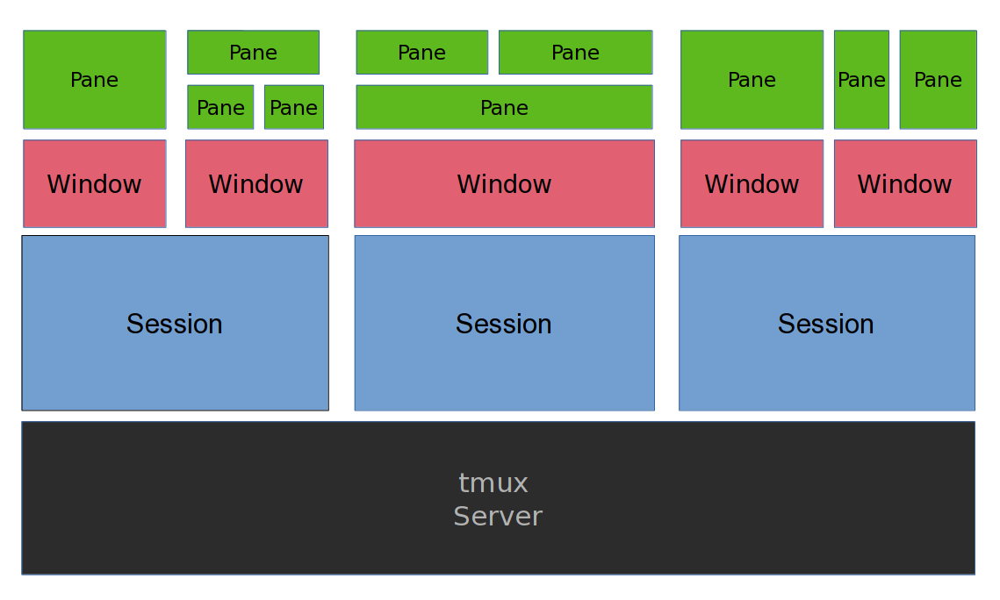

# Terminals

Very personal, I personally use Alacritty for the following reasons:

* sensible defaults
* extensive configurability
* VI mode - move around and create selections using vi bindings
* Search for any text withing the scrollback buffer

---
# Tmux



At the base there's a tmux server.

Each server can have multiple sessions etc.

---
# First try

* `sudo apt install tmux`
* `tmux`

## Basic commands

Prefix: `Ctrl+b` (I recommend to leave this default)

* `tmux list-sessions`
* `tmux kill-server`
* `tmux`
* `<prefix> d` - tmux detach
* `tmux a` - attach

---
# Sessions, Windows, Panes (Splits)

* `<prefix> w` - tmux status
* `<prefix> c` - new-window

## Navigating between windows

* `<prefix> n` - next window
* `<prefix> p` - previous window
* `<prefix> l` - last window
* `<prefix> L` - last session
* `<prefix> 1..0` - go to `1..0` window
* `<prefix> ,` - rename window
* `<prefix> $` - rename session
* `<prefix> &` - kill window

## Panes (Splits)

* `<prefix> v` - vertical split
* `<prefix> s` - horizontal split

I don't use them and they're inverted respective to how vim treats splits.

---
# Tmux scripting

* `tmux new-session -s "foobar" -d -c "$HOME/dev/developer_productivity"` - create a new session in a specific directory
* `tmux new-window -n "foobar" -c "$HOME/dev"`
* `tmux switch-client -t "foobar"` - switches sessions
* `tmux new-window -n "foobar" [some command goes here]`

As you can see there's potential for scripting some tmux commands.

`cht.sh`

---
# Tmux conf part 1

```bash
# List of plugins
set -g @plugin 'tmux-plugins/tpm'
set -g @plugin 'tmux-plugins/tmux-sensible'
set -g @plugin 'tmux-plugins/tmux-resurrect'
set -g @plugin 'tmux-plugins/tmux-prefix-highlight'
set -g @plugin 'schasse/tmux-jump'

# Themes
set -g @plugin 'arcticicestudio/nord-tmux'
# set -g @plugin 'odedlaz/tmux-onedark-theme'

# mouse settings
# set -g mouse on

# bindings settings
set-window-option -g mode-keys vi
bind-key -T copy-mode-vi v send -X begin-selection
bind-key -T copy-mode-vi V send -X select-line
bind-key -T copy-mode-vi y send -X copy-pipe-and-cancel 'xclip -in -selection clipboard'
bind-key -r h run-shell "tmux neww ~/.config/cht.sh"

# allow names to stick
set-option -g allow-rename off

# modify the status bar
set -g status-bg colour233
set -g status-fg colour40
set-option -g status-position top

# don't punish slow release of control when moving windows
bind C-n next-window
bind C-p previous-window

# split panes using v and s
bind v split-window -h
bind s split-window -v
unbind '"'
unbind %

# reload config file
bind r source-file ~/.tmux.conf

# Zsh navigation tools
bind H run-shell -b "~/.config/znt-tmux.zsh"

# hopefully help tmux believe in colourful vim
# set -g default-terminal "xterm-256color"
set-option -gs default-terminal "tmux-256color"
set-option -gas terminal-overrides "*:Tc"
set-option -gas terminal-overrides "*:RGB"

# switch panes using Alt-arrow without prefix
bind -n M-Left select-pane -L
bind -n M-Right select-pane -R
bind -n M-Up select-pane -U
bind -n M-Down select-pane -D
```

---
# Tmux conf part 2

```bash
# base 1 index
set -g base-index 1

# Restoring vim and neovim sessions
# for vim
set -g @resurrect-strategy-vim 'session'
# for neovim
set -g @resurrect-strategy-nvim 'session'

# Restoring pane contents
set -g @resurrect-capture-pane-contents 'off'

# Tmux resurrect
set -g @resurrect-save 'S'
set -g @resurrect-restore 'R'

# Run tmux-resurrect
run-shell ~/.tmux/plugins/resurrect.tmux

# Tmux prefix highlight
set -g status-right '#{prefix_highlight} | %a %Y-%m-%d %H:%M'

# Initialize TMUX plugin manager (keep this line at the very bottom of tmux.conf)
run '~/.tmux/plugins/tpm/tpm'
```

