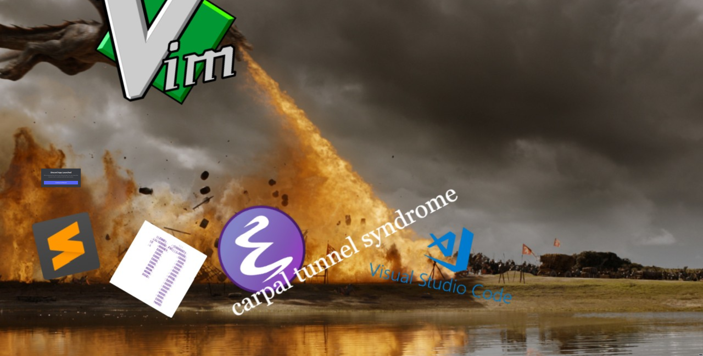
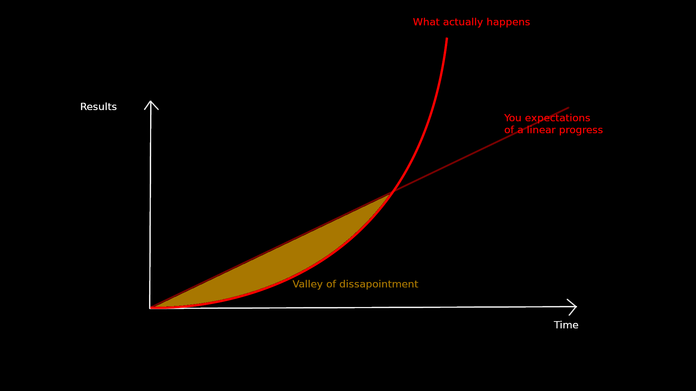
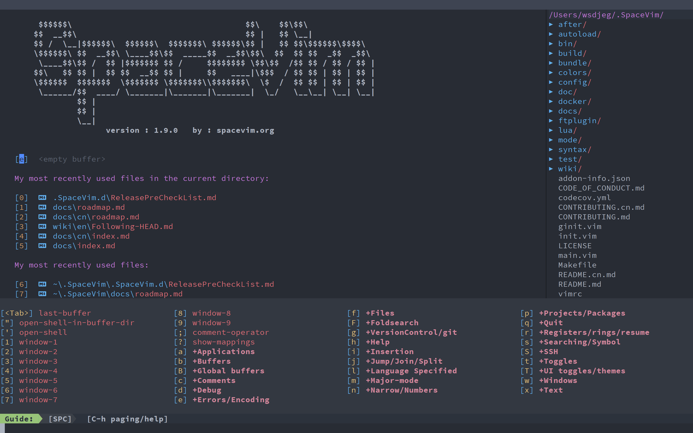

# VIM



---
# Imtroduction (Introduction improved)

## Why use VIM?

### Mastering your tools

_The Pragmatic Programmer_:

_Many programmers make the mistake of adopting a single power tool, such as a particular integrated development
enviroment (IDE), and never leave its cozy interface. This really is a mistake. You need to be comfortable beyond the
limits imposed by an IDE. The only way to do this is to keep the basic tool set sharp and ready to use._

_For a programmer manipulating files of text, that set of basic tools starts in the command shell.
From the shell prompt you should be able to invoke your full repertoire of tools._

_For programmers raised on GUI interfaces and IDEs, this might seem an extreme position. After all, can't you do
everyting by pointing and clicking?_

_The simple answer is "no"._

### Achieving editor fluency

Why is this a big deal? Will you save lots of time? Actually YES.

---

# Vim vs the others


### Configurable

It's highly configurable and you can have an editor that's just like you want it.

---

# Vim vs the others
BUT it's a long term investment.



### Speed

That's it essentially - you won't be a better programmer, you'll be faster.

### LSP

Any language with a language server protocol can have their LSP used by VIM.

---

# Flavors of VIM

* VIM - Vi IMproved
* NeoVim
* SpaceVim
* LunarVim




---

# Are you ready?

* This is a journey, not a day trip
* The journey is uphill
* The top of the mountain is incredible

# How to start

1. `vimtutor`, `VimBeGood` if you get NeoVim
2. VIM extension in VS Code or CLion
3. Create your own setup
4. Check vim communities for latest trends ([r/neovim](https://www.reddit.com/r/neovim/), [r/vim](https://www.reddit.com/r/vim/))
5. Discord channel [discord.gg/3ujcVMe](https://discord.com/invite/3ujcVMe)
6. Youtube channels: [youtube.com/ThePrimeagen](https://www.youtube.com/channel/UC8ENHE5xdFSwx71u3fDH5Xw)

---

# Vim modes

* Normal `<esc>`
* Insert `i`
* Visual
  * Visual line `<S-v>`
  * Visual block `<C-v>`
* Command `:`
* Window `<C-w>`
* Replace `R` <-- I never use it
* Ex <-- nobody knows what's it for

---

# Fundamentals - Files, Buffers, Windows, Splits

## Buffers

Representation of the file in memory.
When you edit a buffer you are editing a representation of the file.
When you write your buffer you overwrite the file in memory.

`:h buffer`

## Windows

A window is a buffer representation.
Windows can be closed but the underlying buffer can remain in memory.

## Splits

A split of a window.

You can create a vertical split by using:

`<C-w>v`

And a horizontal one by using:

`<C-w>s`

---

# Basic

## Movements

DON'T USE YOUR MOUSE AND DON'T USE ARROWS

`h, j, k, l` - move over character

`w, b, e` - move over words

`W, B, E` - move over whitespaces

`<C-o>`, `<C-i>` - move to prev/next change (jumplist)

`<C-d>`, `<C-u>` - half page up/down (predictable)

`{`, `}` - move through a block of code (OVERWRITES THE JUMPLIST)

`%` - move from `<,(,{,[` to `>,),},]`

`f, t, F, T` - find character, then `;` or `,` to move over results

`/` - search, then `n, N`

`<C-^>` - move to last edited file

## Copy (yanking) pasting

`yy, Y, p, P`

## Entering insert mode

`i, I, a, A, o, O, c, C, S`, insert, append, line below, change, replace line

## Relative numbers / Combining commands

* `10j` - go down 10 lines
* `6dd` - delete 6 lines
* `di}` - delete everything inside the `{ ... }` brackets
* `ci(` - change everything inside the `( ... )` brackets
* `viw` - select word

---

# `init.lua` or `init.vim`

_setup presentation_

---

# Quickfix

* `<leader>fg` - Telescope grep
* `<C-q>` - Add results to quickfix list
* `:cfdo %s/ORIGINAL/REPLACEMENT/g | update` - replace within the qf-list

---

# Macros

* Record a macro using `q` + letter: `qd` - records to the register called `d`.
* Stop recording by pressing `q` in normal mode.
* Run macro n times using `19@d` - runs macro 19 times.

---

## Simple macro replace

### First using sed

```cpp
if (some_value == "some_other_value1") {
    return 1
} else if (some_value == "some_other_value2") {
    return 2
} else if (some_value == "some_other_value3") {
    return 3
} else if (some_value == "some_other_value4") {
    return 4
} else if (some_value == "some_other_value5") {
    return 5
} else if (some_value == "some_other_value6") {
    return 6
} else if (some_value == "some_other_value7") {
    return 7
} else if (some_value == "some_other_value8") {
    return 8
} else if (some_value == "some_other_value9") {
    return 9
} else if (some_value == "some_other_value10") {
    return 10
} else if (some_value == "some_other_value11") {
    return 11
} else if (some_value == "some_other_value12") {
    return 12
} else if (some_value == "some_other_value13") {
    return 13
} else if (some_value == "some_other_value14") {
    return 14
} else if (some_value == "some_other_value15") {
    return 15
} else if (some_value == "some_other_value16") {
    return 16
} else if (some_value == "some_other_value17") {
    return 17
} else if (some_value == "some_other_value18") {
    return 18
} else if (some_value == "some_other_value19") {
    return 19
} else if (some_value == "some_other_value20") {
    return 20
}
```

* Visually select the code
* Press `:` -> `:'<,'>`
* `:'<,'>s/.*"\(.*\)".*/case "\1":`

---

### Using a macro

* `qd` - record macro to `d`
* `0` - go to beginning of the line
* `dt"` - delete to `"`
* `f"` - find `"`
* `l` - move on character to the right
* `D` / `d$` - delete till end of line
* `A` - append at the end of the line
* type `:` - text to append
* `I` - insert at beginning of line
* type `case` - text to insert
* `jj` - move to lines below
* `q` - finish recording

---

# Registers

Access using `:reg`

Think of it as a dictionary where you can put what you want.

All registers are accessible via `"` -> register identifier `a` (register `a`) -> action `p` (paste)

1. Yank a line.
2. Locate it in the registers (yes it's under `""` <- the default register where all yanks go).
3. Now yank another line into register `a`: (`"ay`).
4. See your newly yanked selection under the `""` and `"a` registers.

## Register exercise

_Exercise 1:_

* Visually select a line
* `"by` - yank to register `b`
* `"dp` - paste macro registered under `d`
* Edit and rewrite the registered macro under another register

_Exercise 2:_

* Type a macro without registering it into any register
* Register the macro by yanking the line you wrote it in
* Use the macro

---

# Generally recommended plugins

* `tpope/vim-fugitive`
* `tjdevries/telescope.nvim`
* `neovim/lspconfig`
* `kyazdani42/nvim-tree.lua`
* `nvim-treesitter/nvim-treesitter`

## My recommendations

* `voldikss/vim-floaterm`
* `ThePrimeagen/harpoon`
* `romgrk/barbar.nvim`
* `folke/which-key.nvim`
* Some cool colorscheme


## For Bazel

* `google/vim-maktaba`
* `bazelbuild/vim-bazel`
* `alexander-born/bazel-vim`
* `grailbio/bazel-compilation-database`

---

# BONUS

Browser extensions:

* Trydactyl for Firefox
* Vimium for chromium-based browsers
